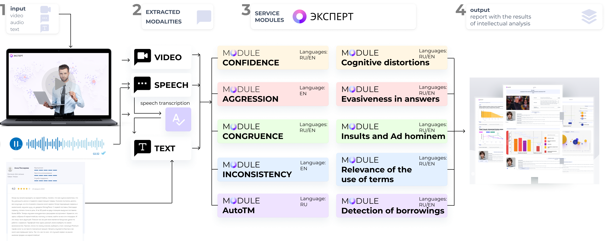

.. start-badges
.. list-table::
   :stub-columns: 1

   * - package
     - | |py_8| |py_9| |py_10|
   * - license
     - | |license|
   * - languages
     - | |eng| |rus|
.. end-badges

**Expert** - is an open-source technology that is designed to assess the validity of expert opinion based on dynamic video content mining.

Expert Features
==========================================================

Service "EXPERT" is designed to assess the consistency of expert opinion based on various parameters obtained by multimodal analysis of audio, video and text data. This development can be applied in the field of education and online learning, HR processes, issues related to the analysis of information of social and political nature.

Expert Applications
==========================================================

- **Authenticity** - is a characteristic that allows us to evaluate the level of consistency of information simultaneously transmitted by a person verbally and non-verbally (audio, video and textual channels).
- **Aggression** - is a qualitative characteristic of a person's attitude toward someone or something, expressed in a state of hostility, ill-will, aggression, anger toward the object of hostility.
- **Confidence** - is a characteristic that allows us to evaluate a property of personality, the core of which is a positive assessment of an individual's own skills and abilities as sufficient to achieve goals meaningful to him and meet his needs.
- **Contradiction** - is a characteristic that allows us to evaluate two statements of which one is the negation of the other. If two statements are in a contradictory relation, then one of them is equivalent to the negation of the other.
- **Transcribe**
- **Summarize**

Installation
==========================================================

Describe how users can install your project.

<Name of your project> can be installed with ``pip``:

.. code-block:: python

    $ pip install <projectname>

How to Use
==========================================================

Describe examples how it should work and should be used.
Images, GIFs and code cells are welcome.
Examples & Tutorials

Documentation
==========================================================

Link to the documentation

Publications About Expert
==========================================================

.. [1] Sinko M.V., Medvedev A.A., Smirnov I.Z., Laushkina A.A., Kadnova A., Basov O.O. Method
       of constructing and identifying predictive models of human behavior based on information
       models of non-verbal signals // Procedia Computer Science - 2022, Vol. 212, pp. 171-180

.. [2] Laushkina A., Smirnov I., Medvedev A., Laptev A., Sinko M. Detecting incongruity in the
       expression of emotions in short videos based on a multimodal approach // Cybernetics and
       physics - 2022, Vol. 11, No. 4, pp. 210–216

Acknowledgments
==========================================================

We acknowledge the contributors for their important impact and the participants of numerous scientific conferences and workshops for their valuable advice and suggestions.

Supported by
==========================================================

Funding research project No. 622279 "Development of a service for assessing the validity of expert opinion based on dynamic intelligent analysis of video content".

Contacts
==========================================================

- Anatoly Medvedev - ML-engineer
- Ivan Smirnov - ML-engineer
- Samigulin Timur - ML-engineer
- Artyom Bondar - ML-engineer
- Alena Komarova - ML-engineer
- Andrei Laptev - Backend Developer
- Nikita Nosov - Backend Developer
- Artyom Chemezov - Frontend Develop
- Olga Hoffman - Scientist
- Nika Kraynovskikh - Researcher
- Anastasia Laushkina - Project Manager, Researcher

Citation
==========================================================
@article{"name",
  title = {},
  author = {},
  journal = {},
  year = {},
  issn = {},
  doi = {}}

.. |eng| image:: https://img.shields.io/badge/lang-en-red.svg
   :alt: Documentation in English
   :target: /README.rst

.. |rus| image:: https://img.shields.io/badge/lang-ru-yellow.svg
   :alt: Documentation in Russian
   :target: /README_ru.rst

.. |py_8| image:: https://img.shields.io/badge/python_3.8-passing-success
   :alt: Supported Python Versions
   :target: https://img.shields.io/badge/python_3.8-passing-success

.. |py_9| image:: https://img.shields.io/badge/python_3.9-passing-success
   :alt: Supported Python Versions
   :target: https://img.shields.io/badge/python_3.9-passing-success

.. |py_10| image:: https://img.shields.io/badge/python_3.10-passing-success
   :alt: Supported Python Versions
   :target: https://img.shields.io/badge/python_3.10-passing-success

.. |license| image:: https://img.shields.io/github/license/expertspec/expert
   :alt: Supported License
   :target: https://github.com/expertspec/expert/blob/master/LICENSE.md
