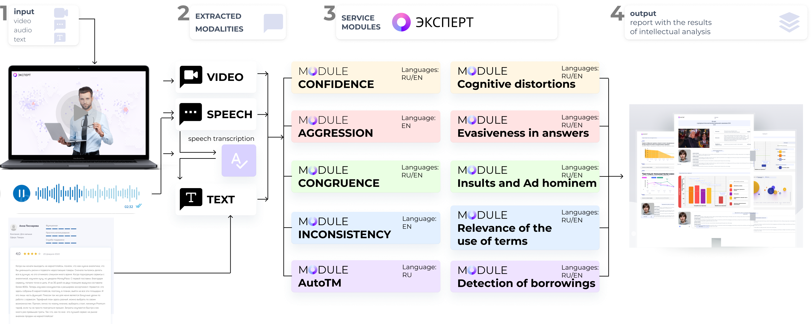

.. start-badges
.. list-table::
   :stub-columns: 1

   * - package
     - | |py_9|
   * - tests
     - | |build| |codecov|
   * - docs
     - | |docs|
   * - license
     - | |license|
   * - languages
     - | |eng| |rus|
   * - acknowledgments
     - | |itmo|
.. end-badges

**Expert** - is a library that is designed to assess the validity of expert opinion based on dynamic intellectual analysis of video content.

Expert Features
===============

"Expert" is designed to assess the validity of expert opinion based on various parameters obtained by multimodal analysis of audio, video and text data. This development can be applied in the field of education and online learning, HR processes, issues related to the analysis of information of social and political nature.

The library was developed as part of a research project funded from the centralized funds of ITMO University.

Table of Contents
=================

- `Expert Applications <Expert Applications_>`_
- `Requirements <Requirements_>`_
- `Installation <Installation_>`_
- `How to Use <How to Use_>`_
- `Documentation <Documentation_>`_
- `Publications About Expert <Publications About Expert_>`_
- `Acknowledgments <Acknowledgments_>`_
- `Supported by <Supported by_>`_
- `Contacts <Contacts_>`_
- `Citation <Citation_>`_

Expert Applications
===================

- **Confidence** - is a characteristic that allows to evaluate a property, the core of which is a positive assessment of an individual's own skills and abilities sufficient to achieve goals meaningful to him.
- **Aggression** - is a qualitative characteristic of a person's attitude toward someone or something, expressed in a state of hostility, ill-will, aggression, anger toward the object of hostility.
- **Congruence** - is a characteristic that allows to evaluate the level of consistency of information simultaneously transmitted by a person verbally and non-verbally (audio, video and textual channels).
- **Contradiction** - is a characteristic that allows to evaluate two statements of which one is the negation of the other. If two statements are in a contradictory relation, then one of them is equivalent to the negation of the other.
- **Speaker Verification**
- **Speech  Recognition and Summarization**

Requirements
============

- Python ~=3.9 (python3.9-full, python3.9-dev)
- pip >=22.0 or PDM >=2.4.8
- CUDA >= 11.7

Installation
============

- **Case A**: If You use Expert as a dependency or third-party package:

Expert can be installed with ``pip``:

.. code-block:: bash

    $ pip install "expert[all] @ git+https://github.com/expertspec/expert.git"

or with ``pdm``:

.. code-block:: bash

    $ pdm add "expert[all] @ git+https://github.com/expertspec/expert.git"

In the case of installation via ``pdm`` as a third-party package, after installation, run the command:

.. code-block:: bash

    $ pdm run pip install mmcv-full~=1.7.0 --ignore-installed --no-cache-dir

This command is needed because the method of installing dependencies in ``pdm`` conflicts with the specific installation method ``mmcv-full``.

The ``expert[all]`` entry means that dependencies from the ``all`` group will be installed.
If you want to install dependencies only from a group of a certain library module,
then enter the name of the required module instead of ``all``.
Installing without specifying a dependency group will result in installing a library
with basic dependencies.

- **Case B**: If You develop and run Expert directly, install it from source:

Clone repository:

.. code-block:: bash

    $ git clone https://github.com/expertspec/expert.git

Install all dependencies from ``pdm.lock`` file:

.. code-block:: bash

    $ pdm sync -G all -v

or optional dependencies for each library module (check ``pyproject.toml``):

.. code-block:: bash

    $ pdm sync -G <group> -v

For update dependency (package) version you need change version in ``pyproject.toml`` and after execute:

.. code-block:: bash

    $ pdm update -G <group> <package>

Run pre-commited hooks:

.. code-block:: bash

    $ pre-commit run (all hooks only for commited changes)
    $ pre-commit run --all-files (all hooks for all changes)
    $ pre-commit run <hook_name> (specified hook)

How to Use
==========

Describe examples how it should work and should be used.
Images, GIFs and code cells are welcome.

Documentation
=============

`Official Documentation <https://expertspec.readthedocs.io/en/latest/index.html>`_

Publications About Expert
=========================

.. [1] Sinko M.V., Medvedev A.A., Smirnov I.Z., Laushkina A.A., Kadnova A., Basov O.O. Method
       of constructing and identifying predictive models of human behavior based on information
       models of non-verbal signals // Procedia Computer Science - 2022, Vol. 212, pp. 171-180

.. [2] Laushkina A., Smirnov I., Medvedev A., Laptev A., Sinko M. Detecting incongruity in the
       expression of emotions in short videos based on a multimodal approach // Cybernetics and
       physics - 2022, Vol. 11, No. 4, pp. 210–216

Acknowledgments
===============

We acknowledge the contributors for their important impact and the participants of numerous scientific conferences and workshops for their valuable advice and suggestions.

Supported by
============

.. image:: docs/img/en/itmo_logo.png
    :width: 300px
    :align: center
    :alt: ITMO university logo

Funding research project No. 622279 "Development of a service for assessing the validity of expert opinion based on dynamic intelligent analysis of video content".

Contacts
========

- Anatolii Medvedev - ML-engineer
- Ivan Smirnov - ML-engineer
- Samigulin Timur - ML-engineer
- Artyom Bondar - ML-engineer
- Alena Komarova - ML-engineer
- Andrei Laptev - Backend Developer
- Artyom Chemezov - Frontend Develop
- Olga Gofman - Scientist
- Nika Kraynovskikh - Researcher
- Anastasiya Laushkina - Project Manager, Researcher

Citation
========

.. code-block:: bash

    @software{expertspec,
        title = {expert},
        author = {Laushkina, Anastasiya and Smirnov, Ivan and Medvedev, Anatolii et al.},
        year = {2023},
        url = {https://github.com/expertspec/expert},
        version = {1.0.0}
    }

.. |eng| image:: https://img.shields.io/badge/lang-en-deepgreen.svg
   :alt: Documentation in English
   :target: /README.rst

.. |rus| image:: https://img.shields.io/badge/lang-ru-red.svg
   :alt: Documentation in Russian
   :target: /README_ru.rst

.. |py_9| image:: https://img.shields.io/badge/python_3.9-passing-success
   :alt: Supported Python Versions
   :target: https://img.shields.io/badge/python_3.9-passing-success

.. |license| image:: https://img.shields.io/github/license/expertspec/expert?color=deepgreen
   :alt: Supported License
   :target: https://github.com/expertspec/expert/blob/master/LICENSE

.. |itmo| image:: docs/img/en/ITMO_badge.svg
   :alt: Acknowledgement ITMO
   :target: https://itmo.ru/

.. |codecov| image:: https://codecov.io/gh/expertspec/expert/branch/main/graph/badge.svg?token=OLKZESJUOY
   :target: https://codecov.io/gh/expertspec/expert

.. |build| image:: https://github.com/expertspec/expert/actions/workflows/build_with_codecov.yml/badge.svg?branch=main
   :alt: Build Status
   :target: https://github.com/expertspec/expert/actions

.. |docs| image:: https://readthedocs.org/projects/expertspec/badge/?version=latest
    :target: https://expertspec.readthedocs.io/en/latest/?badge=latest
    :alt: Documentation Status
