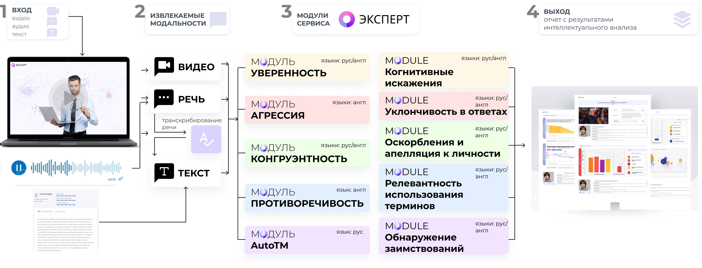

.. start-badges
.. list-table::
   :stub-columns: 1

   * - package
     - | |py_9|
   * - tests
     - | |build| |codecov|
   * - docs
     - | |docs|
   * - license
     - | |license|
   * - languages
     - | |eng| |rus|
   * - acknowledgments
     - | |itmo|
.. end-badges

**Эксперт** - это библиотека, которая предназначена для оценки состоятельности экспертного мнения на основе динамического интеллектуального анализа видеоконтента.

Особенности технологии
======================

"Эксперт" предназначен для оценки состоятельности экспертного мнения на основе различных параметров, полученных в результате мультимодального анализа аудио-, видео- и текстовых данных. Данная разработка может применяться в сфере образования и онлайн-обучения, HR-процессов, вопросов, связанных с анализом информации социального и политического характера.

Библиотека разработана в рамках научно-исследовательской работы, финансируемой из централизованных средств федерального государственного автономного образовательного учреждения высшего образования "Национального исследовательского университета ИТМО".

Оглавление
=================

- `Область применения <Область применения_>`_
- `Требования <Требования_>`_
- `Установка <Установка_>`_
- `Как использовать <Как использовать_>`_
- `Документация <Документация_>`_
- `Публикации об Эксперт <Публикации об Эксперт_>`_
- `Благодарности <Благодарности_>`_
- `При поддержке <При поддержке_>`_
- `Контакты <Контакты_>`_
- `Цитирование <Цитирование_>`_

Область применения
==================

- **Уверенность** - это характеристика, которая предназначена для оценки уровня уверенности говорящего. Основой для формирования уверенности служит позитивный опыт решения социальных задач и успешного достижения поставленных целей.
- **Агрессия** - это характеристика, которая предназначена для оценки уровня агрессии говорящего. Агрессию стоит понимать как мотивированное разрушительное поведение, противоречащее нормам и правилам существования людей в обществе, причиняющее вред объектам нападения, наносящее физический ущерб или вызывающее у них психический дискомфорт.
- **Конгруэнтность** - это характеристика, которая предназначена для оценки уровня согласованности эмоций говорящего по трем каналам – аудио, видео и текст.
- **Непротиворечивость** - это характеристика, которая позволяет сравнить два высказывания с целью определения класса логической связи.
- **Верификация спикера**
- **Распознавание и аннотирование речи**

Требования
==========

- Python ~=3.9 (python3.9-full, python3.9-dev)
- pip >=22.0 или PDM >=2.4.8
- CUDA >= 11.7

Установка
=========

- **Случай А**: Если Вы используете Expert в качестве зависимости или стороннего пакета:

Эксперт может быть установлен с помощью ``pip``:

.. code-block:: bash

    $ pip install "expert[all] @ git+https://github.com/expertspec/expert.git"

или с помощью ``pdm``:

.. code-block:: bash

    $ pdm add "expert[all] @ git+https://github.com/expertspec/expert.git"

В случае с установкой через ``pdm`` как стороннего пакета, после установки запустите команду:

.. code-block:: bash

    $ pdm run pip install mmcv-full~=1.7.0 --ignore-installed --no-cache-dir

Данная команда нужна из-за того, что метод установки зависимостей в ``pdm`` конфликтует со специфическим
методом установки ``mmcv-full``.

Запись ``expert[all]`` означает, что будут установлены зависимости из группы ``all``.
Если вы хотите установить зависимости только из группы определенного модуля библиотеки,
то впишите вместо ``all`` название необходимого модуля.
Установка без указания группы зависимостей приведет к установке
библиотеки лишь с базовыми зависимостями

- **Случай Б**: Если Вы разрабатываете и запускаете Expert напрямую, установите его из исходников:

Склонировать репозиторий:

.. code-block:: bash

    $ git clone https://github.com/expertspec/expert.git

Установить все зависимости из ``pdm.lock`` файла:

.. code-block:: bash

    $ pdm sync -G all -v

или опциональные зависимости для каждого отдельного модуля библиотеки (см. ``pyproject.toml``):

.. code-block:: bash

    $ pdm sync -G <group> -v

Запустить прекоммитные хуки:

Для обновления версии зависимости (пакета) вам необходимо изменить версию в ``pyproject.toml`` и после выполнить:

.. code-block:: bash

    $ pdm update -G <group> <package>

.. code-block:: bash

    $ pre-commit run (все хуки, только для закоммиченых изменений)
    $ pre-commit run --all-files (все хуки для любых изменений)
    $ pre-commit run <hook_name> (определенный хук)

Как использовать
================

Опишите примеры, как это должно работать и использоваться.
Изображения, GIF-файлы и ячейки кода приветствуются.

Документация
============

https://github.com/ITMO-NSS-team/open-source-ops/blob/master/tutorials/documentation.rst

Публикации об Эксперт
=====================

.. [1] Sinko M.V., Medvedev A.A., Smirnov I.Z., Laushkina A.A., Kadnova A., Basov O.O. Method
       of constructing and identifying predictive models of human behavior based on information
       models of non-verbal signals // Procedia Computer Science - 2022, Vol. 212, pp. 171-180

.. [2] Laushkina A., Smirnov I., Medvedev A., Laptev A., Sinko M. Detecting incongruity in the
       expression of emotions in short videos based on a multimodal approach // Cybernetics and
       physics - 2022, Vol. 11, No. 4, pp. 210–216

Благодарности
=============

Мы благодарим сообщество за важный вклад в развитие библиотеки и участников многочисленных научных конференций и семинаров за их ценные советы и предложения.

При поддержке
=============

.. image:: docs/img/en/itmo_logo.png
    :width: 300px
    :align: center
    :alt: ITMO university logo

Выполнено при финансировании НИР №622279 "Разработка сервиса оценки состоятельности экспертного мнения на основе динамического интеллектуального анализа видеоконтента".

Контакты
========

- Анатолий Медведев - ML-engineer
- Иван Смирнов - ML-engineer
- Самигулин Тимур - ML-engineer
- Артём Бондарь - ML-engineer
- Алёна Комарова - ML-engineer
- Андрей Лаптев - Backend Developer
- Никита Носов - Backend Developer
- Артем Чемезов - Frontend Develop
- Ольга Гофман - Scientist
- Ника Крайновских - Researcher
- Анастасия Лаушкина - Project Manager, Researcher

Цитирование
===========

@online{expert,
  author = {Laushkina, Anastasia and Smirnov, Ivan and Medvedev, Anatolii et al.},
  title = {2023},
  url = {https://github.com/expertspec/expert},
  urldate = {2023-03-20}}

.. |eng| image:: https://img.shields.io/badge/lang-en-red.svg
   :alt: Documentation in English
   :target: /README.rst

.. |rus| image:: https://img.shields.io/badge/lang-ru-deepgreen.svg
   :alt: Documentation in Russian
   :target: /README_ru.rst

.. |py_9| image:: https://img.shields.io/badge/python_3.9-passing-success
   :alt: Supported Python Versions
   :target: https://img.shields.io/badge/python_3.9-passing-success

.. |license| image:: https://img.shields.io/github/license/expertspec/expert
   :alt: Supported License
   :target: https://github.com/expertspec/expert/blob/master/LICENSE.md

.. |itmo| image:: docs/img/ru/ITMO_badge_rus.svg
   :alt: Acknowledgement ITMO
   :target: https://itmo.ru/

.. |codecov| image:: https://codecov.io/gh/expertspec/expert/branch/main/graph/badge.svg?token=OLKZESJUOY 
   :target: https://codecov.io/gh/expertspec/expert

.. |build| image:: https://github.com/expertspec/expert/actions/workflows/build_with_codecov.yml/badge.svg?branch=main
   :alt: Build Status
   :target: https://github.com/expertspec/expert/actions

.. |docs| image:: https://readthedocs.org/projects/expertspec/badge/?version=latest
    :target: https://expertspec.readthedocs.io/en/latest/?badge=latest
    :alt: Documentation Status