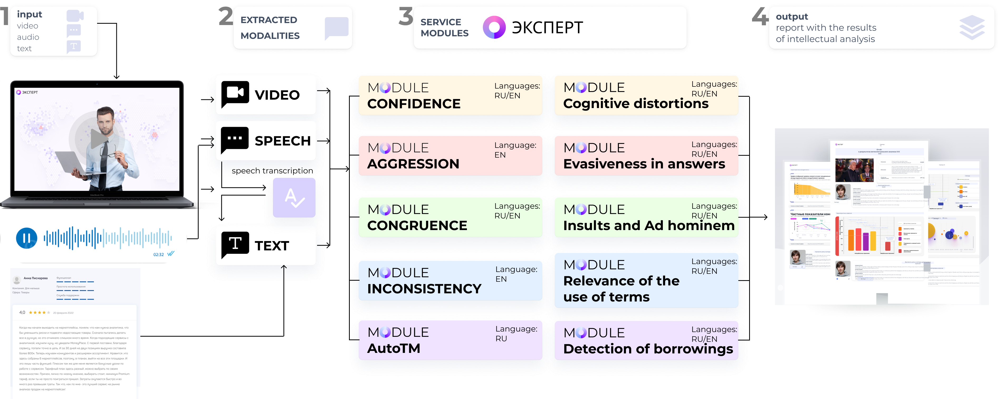

Intro to Expert
===============

"Expert" is designed to assess the validity of expert opinion based on various parameters obtained by multimodal analysis of audio, video and text data. 
This development can be applied in the field of education and online learning, HR processes, issues related to the analysis of information of social and political nature.

